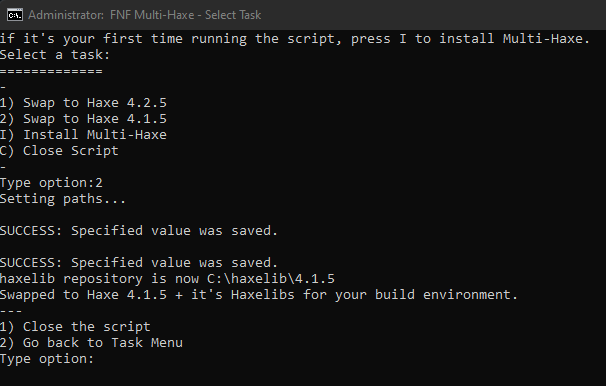

A script that allows you to install both Haxe 4.1.5 and 4.2.5 at the same time and swap between the versions in 1 second!
Useful if you work with both Kade Source Code and Psych Source Code

| [Download here](https://github.com/MeguminBOT/FNF-Source-MultiHaxe-Installer/releases/tag/V1.0.0) | [Gamebanana Page](https://gamebanana.com/tools/9716) | [Video: Script in Action](https://youtu.be/mkXzcPHFKFw) |
|--|--|--|

# FNF-Source-MultiHaxe-Installer
   

### Table of Contents
  - [Introduction](#introduction)
  - [Supported Operating Systems](#supported-operating-systems)
  - [Supported Terminals](#supported-terminals)
  - [If you are paranoid over executable scripts on the internet](#if-you-are-paranoid-over-executable-scripts-on-the-internet)
  - [Having Issues?](#having-issues)

---

### Introduction
This is a simple script that installs both Haxe 4.1.5 and Haxe 4.2.5 to allow you to work with FNF engines that require different haxe versions.

After you installed MultiHaxe, you can swap between versions by running the script again and use the swap options to change versions in 1 second!

The swapping options changes the System Environment paths and Haxelib directory to the correct versions so you don't have to do it manually.
(It will ask for admin privileges since it needs to change the system variables)
---

### Supported Operating Systems

- Windows 10 v1703 or higher (64-bit version only)
- Windows 11

---

### Supported Terminals
- Windows 10/11 Command Prompt
- Windows 11 Terminal

_PowerShell, Mingw64, Git Bash or similar are **NOT** supported_

---

### If you are paranoid over executable scripts on the internet
You can check the code here on GitHub and see exactly where it downloads the software from and what it's installing. 
You could check VirusTotal.com too but that's useless for most bat scripts unless they invoke some real sketchy stuff, which this doesn't.

---
### Having Issues?
Having troubles with the script?

Post a new issue [here](https://github.com/MeguminBOT/FNF-Source-MultiHaxe-Installer/issues) and I'll get back to you as fast as I can
